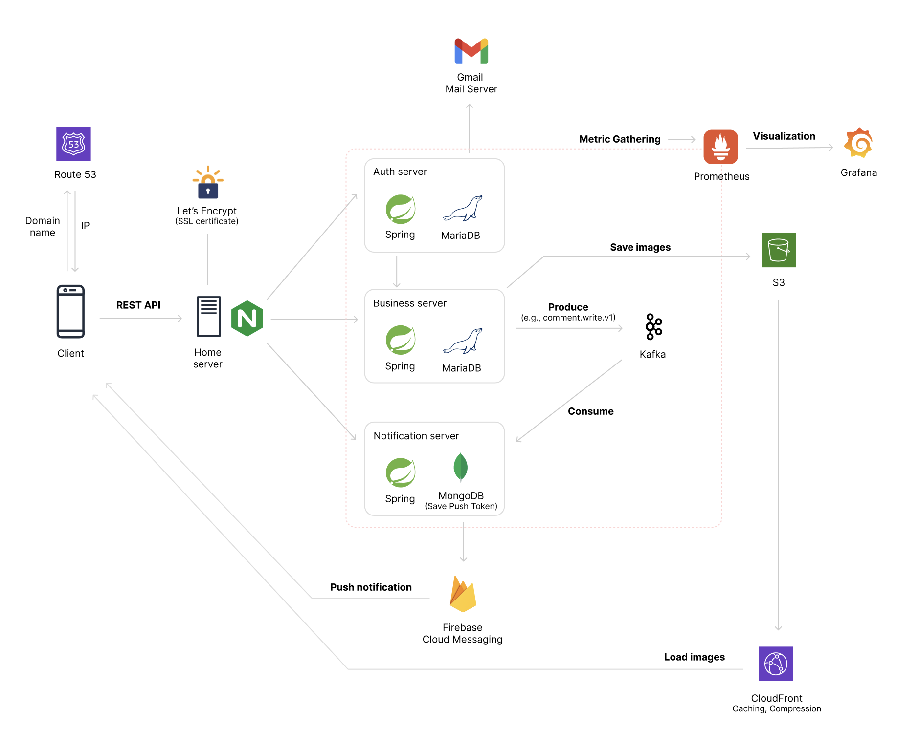
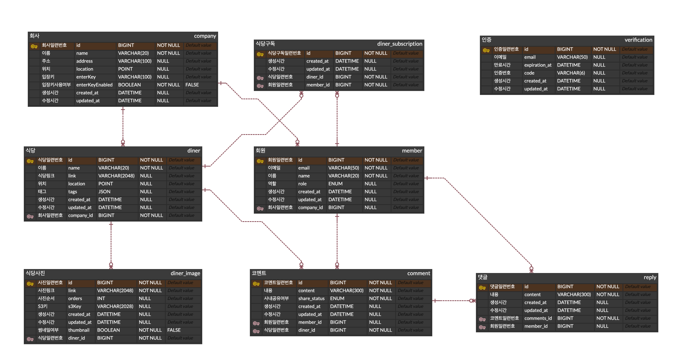
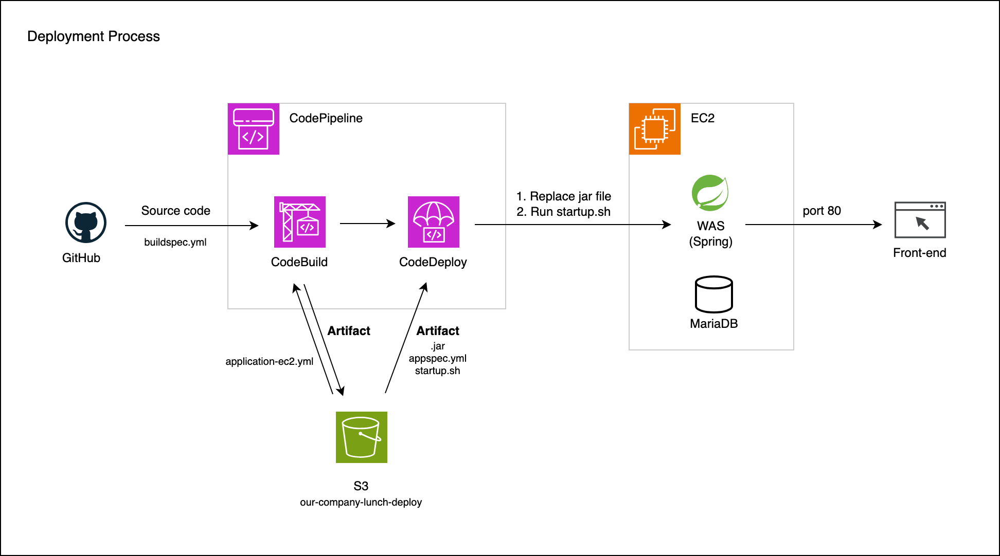

# 프로젝트 설명

## 우리 회사 점심 - 직장인 점심 기록 서비스 백엔드

- 서비스를 가입하고, 회사를 등록한 후, 직접 주변에 있는 식당을 등록합니다.
- 자신이 먹은 점심과 식당에 대한 코멘트를 기록하고, 회사 내에서 공유합니다.

## 서비스 기대효과

- 자신의 코멘트와 다른 동료들의 코멘트를 확인하고, 다음 점심을 선택할 때 참고합니다.
- 회사내 아는 사람들에 의한 코멘트이므로 다른 리뷰보다 믿을 수 있습니다.

# 시스템 구성도



# Tech Stack

- Java 21
- Spring Boot 3.2.9
- Spring Web
- Spring Security
- Spring Validation
- Spring Data JPA
- Spring Actuator
- QueryDSL 5.0.0
- MariaDB
- MongoDB
- Gmail Mail Server
- Mockito
- Lombok
- AWS S3
- AWS CloudFront
- Kafka
- Firebase Cloud Messaging
- Let's Encrypt
- Promethues
- Grafana
- Github Action

# Github 저장소 분리

- 서버 로직을 분리하기 위해 저장소를 분리했습니다.
  - Business Server: https://github.com/marcel1315/our-company-lunch (현재 저장소)
  - Auth Server: https://github.com/marcel1315/our-company-lunch-auth-server
  - Notification Server: https://github.com/marcel1315/our-company-lunch-noti-server
  - common library: https://github.com/marcel1315/our-company-lunch-common

# ERD

- Business Server ERD
  

# 서비스 제공 기능

- 회원가입 기능
  - 사용자는 회원가입을 할 수 있다.
  - 회원가입시 이메일, 이름과 비밀번호를 입력받는다. 이메일이 아이디가 되며 서비스내에서 유일해야한다.
  - 회원가입 중 이메일을 통한 번호인증을 한다.

- 로그인 기능
  - 사용자는 로그인을 할 수 있다. 로그인시 회원가입때 사용한 아이디(이메일)와 패스워드가 일치해야 한다.

- 회원정보 수정 기능
  - 사용자는 자신의 이름을 수정할 수 있다.

- 회원탈퇴 기능
  - 아이디(이메일)과 비밀번호로 탈퇴할 수 있다.

- 회사 등록 기능
  - 사용자는 회사를 등록할 수 있다.
  - 회사 등록시 이름, 주소, 위도, 경도를 입력한다.
  - 회사 등록시 enterKey 라는 것을 입력하고, 이 키를 통해 다른 회사원들이 등록된 회사에 들어올 수 있다.

- 회사 조회 및 선택 기능
  - 사용자는 등록된 회사들을 조회할 수 있다.
  - 사용자는 조회된 회사들 중 하나를 선택한다. enterKey를 입력해서 들어갈 수 있다.

- 회사 정보 수정 기능
  - 사용자는 회사 정보를 수정할 수 있다. 주소, 위도, 경도를 수정할 수 있다.
  - 회사 정보 수정을 위해 이메일을 통한 번호 인증을 해야한다.

- 식당 등록 기능
  - 사용자는 식당을 등록할 수 있다.
  - 식당 이름, 식당 웹사이트 링크, 위도, 경도 정보를 입력한다.
  - 식당 태그도 입력 가능하다. (#한식, #양식, #깔끔, #간단, #매움, #양많음 등 사용자가 임의 등록 가능)

- 식당 수정 기능
  - 사용자는 식당 웹사이트 링크, 위도, 경도 정보를 수정할 수 있다. 자신이 작성하지 않은 식당도 수정할 수 있다.
  - 식당 태그도 추가 등록, 삭제가 가능하다.
  - 식당 메뉴 등을 위한 사진을 업로드 및 삭제할 수 있다. 사진 업로드 시 이미지 파일과 함께 사진이 나타날 순서도 함께 입력한다. 사진 순서도 수정할 수 있다.

- 식당 목록 조회 기능
  - 사용자는 식당의 목록을 조회할 수 있다.
  - 식당 이름, 태그, 거리, 코멘트 갯수를 목록으로 볼 수 있다.
  - 회사의 위도와 경도, 식당의 위도와 경도를 사용해 회사로부터 식당의 거리를 표시한다.
  - 식당은 식당 이름, 거리, 코멘트 갯수로 정렬할 수 있다.

- 식당 상세 조회 기능
  - 사용자는 식당을 상세 조회할 수 있다.
  - 이름, 태그, 거리, 코멘트 갯수, 코멘트 목록, 사진 썸네일 목록을 볼 수 있다.
  - 필요한 경우 원본 사진을 가져올 수 있다.

- 식당 제거 기능
  - 사용자는 식당을 제거할 수 있다. 자신이 작성하지 않은 식당도 삭제 할 수 있다.

- 코멘트 작성 기능
  - 사용자는 등록된 식당에 대해 코멘트를 작성할 수 있다.
  - 식당, 코멘트 내용, 사내 공유 여부를 입력한다.

- 코멘트 조회 기능
  - 사용자는 사내 공유된 코멘트 목록을 조회할 수 있다.
  - 본인 여부, 작성자 이름, 코멘트 내용, 식당으로 목록을 조회할 수 있다.

- 코멘트 수정 기능
  - 사용자는 자신이 작성한 코멘트를 수정할 수 있다.
  - 코멘트 내용, 사내 공유 여부를 수정할 수 있다.

- 코멘트 삭제 기능
  - 사용자는 자신이 작성한 코멘트를 삭제할 수 있다.

- 댓글 작성, 수정 및 제거 기능
  - 사용자는 코멘트에 댓글 작성, 수정 및 제거가 가능하다.
  - 댓글은 모든 코멘트에 대해 작성 가능하다.
  - 수정 및 제거는 자신이 작성한 댓글만 가능하다.

- 식당 구독 및 알림 기능
  - 사용자는 식당을 구독하거나 구독 취소할 수 있다.
  - 구독한 식당에 코멘트가 달리면, 사용자는 알림을 받는다.

# API

## Swagger API Docs

- Business API: https://api.ourcompanylunch.com/swagger-ui/index.html
- Auth API: https://auth-dev.ourcompanylunch.com/swagger-ui/index.html
- Notification API: https://noti-dev.ourcompanylunch.com/swagger-ui/index.html

## 주요 API 사용 흐름 예시

### 1. 회원 가입 후 회사 등록 및 선택

1. Auth Server - POST /users/send-verification-code
   
   회원가입을 위해 인증코드를 받습니다.

2. Auth Server - POST /users/signup

   이메일, 비밀번호, 이름, 인증코드를 전달하며 회원가입을 합니다.

3. Auth Server - POST /users/signin

   로그인을 하고, JWT token을 돌려받습니다. 아래 사용되는 API들의 Header에 Authorization: Bearer {token} 을 넣어 보냅니다. Swagger에서는 오른쪽 상단의 Authorize에 (Bearer없이) 토큰값만 넣으면 됩니다. 

4. Business Server - POST /companies

   자신의 회사를 등록합니다. 입력하는 위도, 경도는 추후에 식당과의 거리를 계산하기 위해 사용됩니다.

5. Business Server - GET /companies

   등록되어 있는 회사 목록을 볼 수 있습니다.

6. Business Server - PUT /companies/1/choose

   사용자가 회사를 선택합니다. 사용자는 1곳의 회사만 선택할 수 있습니다. 이메일 도메인이 일치하는 다른 회사로 추후에 변경할 수도 있습니다.

### 2. 식당 등록 후 사진 업로드

1. Business Server - POST /diners

   자신의 회사에 식당을 생성합니다.

2. Business Server - GET /diners

   자신의 회사에 등록된 식당 목록을 받아옵니다.

3. Business Server - POST /diners/1/images/

   특정 식당의 사진을 업로드합니다.

### 3. 식당의 코멘트 조회 및 코멘트 작성

1. Business Server - GET /diners/1/comments

   특정 식당에 달린 코멘트들을 조회합니다.

2. Business Server - POST /diners/1/comments

   특정 식당에 코멘트를 답니다.

### 4. 식당 알림받기

1. Notification Server - POST /notifications/fcm/token

   알림을 받기 위해 클라이언트는 FCM 서비스로부터 token을 받아야합니다. 받은 FCM token을 해당 서버에 등록합니다.

2. Business Server - POST /diners/1/comments

   식당을 구독하는 다른 계정에서 코멘트를 작성합니다. 코멘트가 작성되면, 구독자를 찾아 알림을 전송합니다.

# Development Setup

- 각 서버에서 docker-compose.yml 파일을 실행합니다. 각 서버마다 필요한 의존성이 들어있습니다.

- application-sample.yml 파일을 바탕으로 application-local.yml 파일을 작성합니다. 필요한 외부 서비스의 비밀번호 등을 넣습니다.

- 개발하는 환경에서 AWS 계정에 접속할 수 있는 프로필이 있어야 합니다. 

- 사진 저장소용 S3 버킷을 만들어 프로젝트에 연결합니다. 버킷의 이름은 applicatoin-local.yml에 입력합니다.

- Mail Server로 Gmail을 사용합니다. Gmail에서 앱 비밀번호를 발급받아 application-local.yml에 입력합니다.

- Notification 서버를 위해 Firebase 프로젝트가 있어야 하며, 서비스 계정 json 파일을 환경변수로 설정해야 합니다. 개발 환경에서는 intelliJ 에서 Run Configuration에서 env로 설정할 수 있습니다.
  ```bash
  export GOOGLE_APPLICATION_CREDENTIALS="/home/user/Downloads/service-account-file.json"
  ```

# Deployment Setup (Home Server)
- 전체 서버의 홈서버 배포 과정
  

- 각 서버의 S3 배포용 버킷이 필요합니다.

- 각 서버에서 application-sample.yml 파일을 바탕으로 application-mac.yml 파일을 작성해 각 서버 S3 배포 버킷에 업로드합니다.

- 각 서버에서 docker-compose.yml 파일을 바탕으로 docker-compose.mac.yml 파일을 작성해 각 서버 S3 배포 버킷에 업로드합니다.

- Notification 서버에서 Firebase project에서 json 파일을 다운로드 받아 파일 이름을 "our-company-lunch-firebase-adminsdk.json"로 변경 후 Notification Server S3 배포 버킷에 업로드합니다.

- Metric docker compose 파일은 Business Server 저장소의 /metrics/에 있습니다.

- common 라이브러리에서 버전 태그를 붙이고, 그 버전을 사용하기 위해서는 각 서버에서 implementation의 version을 올려줘야 합니다.

- 배포되는 환경(home server)에서 AWS 계정에 접속할 수 있는 프로필이 있어야 합니다.

# 용어

- 코멘트 : 짧은 글인 것을 강조하기 위해 “글” 또는 “리뷰”보다 “코멘트”라는 용어를 사용합니다. "글"은 제목과 본문을 가지고 길게 써야할 것 같고, "리뷰"는 평점이 들어가야 할 것 같아 피했습니다.