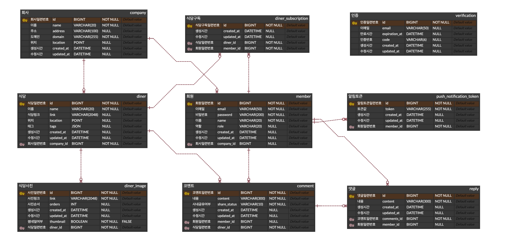
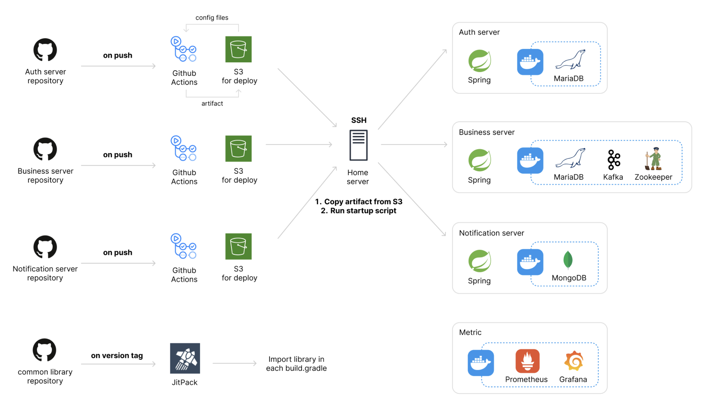

# 프로젝트 설명

## 우리 회사 점심 - 직장인 점심 기록 서비스 백엔드

- 회사 이메일로 서비스를 가입하고, 직접 주변에 있는 식당을 등록합니다.
- 자신이 먹은 점심과 식당에 대한 코멘트를 기록하고, 사내에서 공유합니다.

## 서비스 기대효과

- 자신의 코멘트와 다른 동료들의 코멘트들을 확인하고, 다음 점심을 선택할 때 참고합니다.
- 사내 아는 사람들에 의한 코멘트이므로 포털 리뷰보다 믿을 수 있습니다.

# 프로젝트 기능

- 회원가입 기능
  - 사용자는 회원가입을 할 수 있다. 모든 사용자는 회원가입 시 USER 권한(일반 권한)을 지닌다.
  - 회원가입시 이메일, 이름과 비밀번호를 입력받는다. 이메일이 아이디가 되며 unique 해야한다.
  - 구글, 네이버, 카카오, 다음, 한메일, 야후 등 이메일 공급자로부터 받은 이메일은 가입할 수 없다. 회사 도메인을 사용해야 한다.
  - 회원가입 중 이메일을 통한 번호인증을 한다.

- 로그인 기능
  - 사용자는 로그인을 할 수 있다. 로그인시 회원가입때 사용한 아이디(이메일)와 패스워드가 일치해야 한다.

- 회원정보 수정 기능
  - 사용자는 자신의 이름을 수정할 수 있다.

- 회원탈퇴 기능
  - 아이디(이메일)과 비밀번호로 탈퇴할 수 있다.

- 회사 등록 기능
  - 사용자는 회사를 등록할 수 있다. 가입한 이메일 도메인으로 회사가 등록된다.
  - 회사 등록시 이름, 주소, 위도, 경도를 입력한다.
  - 같은 회사라도 여러 주소가 있을 수 있으므로, 같은 도메인의 회사 등록은 여러 곳이 가능하다.

- 회사 조회 및 선택 기능
  - 사용자는 가입한 이메일 도메인으로 등록된 회사들을 조회할 수 있다.
  - 사용자는 조회된 회사들 중 하나를 선택한다.

- 회사 정보 수정 기능
  - 사용자는 회사 정보를 수정할 수 있다. 주소, 위도, 경도를 수정할 수 있다.
  - 회사 정보 수정을 위해 이메일을 통한 번호 인증을 해야한다.

- 식당 등록 기능
  - 사용자는 식당을 등록할 수 있다.
  - 식당 이름, 식당 웹사이트 링크, 위도, 경도 정보를 입력한다.
  - 식당 태그도 입력 가능하다. (#한식, #양식, #깔끔, #간단, #매움, #양많음 등 사용자가 임의 등록 가능)

- 식당 수정 기능
  - 사용자는 식당 웹사이트 링크, 위도, 경도 정보를 수정할 수 있다. 자신이 작성하지 않은 식당도 수정할 수 있다.
  - 식당 태그도 추가 등록, 삭제가 가능하다.
  - 식당 메뉴 등을 위한 사진을 업로드 및 삭제할 수 있다. 사진 업로드 시 이미지 파일과 함께 사진이 나타날 순서도 함께 입력한다. 사진 순서도 수정할 수 있다.

- 식당 목록 조회 기능
  - 사용자는 식당의 목록을 조회할 수 있다.
  - 식당 이름, 태그, 거리, 코멘트 갯수를 목록으로 볼 수 있다.
  - 회사의 위도와 경도, 식당의 위도와 경도를 사용해 회사로부터 식당의 거리를 표시한다.
  - 식당은 식당 이름, 거리, 코멘트 갯수로 정렬할 수 있다.

- 식당 상세 조회 기능
  - 사용자는 식당을 상세 조회할 수 있다.
  - 이름, 태그, 거리, 코멘트 갯수, 코멘트 목록, 사진 썸네일 목록을 볼 수 있다.
  - 필요한 경우 원본 사진을 가져올 수 있다.

- 식당 제거 기능
  - 사용자는 식당을 제거할 수 있다. 자신이 작성하지 않은 식당도 삭제 할 수 있다.

- 코멘트 작성 기능
  - 사용자는 등록된 식당에 대해 코멘트를 작성할 수 있다.
  - 식당, 코멘트 내용, 사내 공유 여부를 입력한다.

- 코멘트 조회 기능
  - 사용자는 사내 공유된 코멘트 목록을 조회할 수 있다.
  - 본인 여부, 작성자 이름, 코멘트 내용, 식당으로 목록을 조회할 수 있다.

- 코멘트 수정 기능
  - 사용자는 자신이 작성한 코멘트를 수정할 수 있다.
  - 코멘트 내용, 사내 공유 여부를 수정할 수 있다.

- 코멘트 삭제 기능
  - 사용자는 자신이 작성한 코멘트를 삭제할 수 있다.

- 댓글 작성, 수정 및 제거 기능
  - 사용자는 코멘트에 댓글 작성, 수정 및 제거가 가능하다.
  - 댓글은 모든 코멘트에 대해 작성 가능하다.
  - 수정 및 제거는 자신이 작성한 댓글만 가능하다.

- 식당 구독 및 알림 기능
  - 사용자는 식당을 구독하거나 구독 취소할 수 있다.
  - 구독한 식당에 코멘트가 달리면, 사용자는 알림을 받는다.
  - 사용자는 알림을 받기 위해 SSE 연결을 맺을 수 있고, FCM(Firebase Cloud Messaging) 토큰을 등록할 수 있다.  

# ERD



# Tech Stack

- Java 21

- Spring Boot 3.2.5

- Spring Web

- Spring Security

- Spring Validation

- Spring Data JPA

- QueryDSL 5.0.0

- MariaDB

- Java Mail Sender

- Mockito

- Lombok

- AWS S3

- SSE(Server Side Event)

- RabbitMQ

- Firebase Cloud Messaging

# 시스템 구성도


# 개발 환경 설정

- MariaDB에 접속할 수 있어야 합니다. 접속 정보는 application-dev.yml에서 설정합니다.

- Mail Server로 Gmail을 사용합니다. Gmail에서 앱 비밀번호를 발급받아 application-dev.yml에 추가해야 합니다.

- 개발하는 환경에서 AWS 계정에 접속할 수 있어야 하고, S3에 버킷을 만들어 프로젝트에 연결합니다. 버킷의 이름은 applicatoin-dev.yml에서 설정합니다.

- RabbitMQ가 설치되고 기본포트(5692)를 사용해서 연결합니다. 포트 및 연결 설정을 변경하려면 application-dev.yml을 수정합니다.

- Firebase 프로젝트가 있어야 하며, 서비스 계정 json 파일을 환경변수로 설정해야 합니다.
  
  ```bash
  export GOOGLE_APPLICATION_CREDENTIALS="/home/user/Downloads/service-account-file.json"
  ```

# 배포

## Prerequisite

- AWS account가 있어야 하고, 아래에서 사용되는 리소스들에 접근할 수 있는 권한이 있어야 합니다.

- CodeBuild가 실행되려면 Private subnet과 NAT Gateway가 필요합니다. CloudFormation을 사용해 NAT와 EIP를 생성합니다. NAT가 준비되는데 약 5분이 소요됩니다.  
  ```bash
  aws cloudformation create-stack --stack-name nat-for-codebuild --template-body file://$(pwd)/cloudformation-for-codebuild.yml
  ```

- 약 3분 후 CloudFormation의 상태를 확인해봅니다. CREATE_COMPLETE 상태가 되면, 배포할 수 있습니다.
  ```bash
  aws cloudformation describe-stacks --stack-name nat-for-codebuild --query "Stacks[0].StackStatus"
  ```

- NAT를 상시로 띄워놓으면 불필요한 요금이 나오므로, 배포가 완료되면 다시 CloudFormation으로 NAT를 제거합니다.
  ```bash
  aws cloudformation delete-stack --stack-name nat-for-codebuild
  ```

## How-to



- github 저장소의 main 브랜치에 배포할 내용을 푸시합니다.

- application-ec2.yml 파일을 작성해 S3에 업로드합니다.

- CodePipeline의 배포를 시작합니다.
  ```bash
  aws codepipeline start-pipeline-execution --name our-company-lunch-pipeline
  ```

# Glossary

- 코멘트 : 짧은 글인 것을 강조하기 위해 “글” 또는 “리뷰”보다 “코멘트”라는 용어를 사용합니다. "글"은 제목과 본문을 가지고 길게 써야할 것 같습니다. "리뷰"는 평점이
  들어가야 할 것 같습니다.

# Troubleshooting

- [Go to the troubleshooting section](doc/TROUBLESHOOTING)