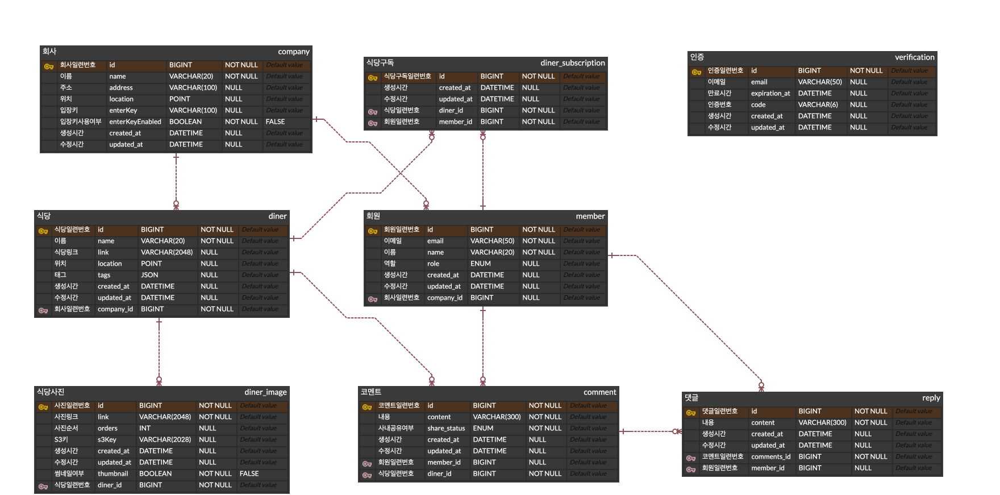

# Project overview

## Our Company Lunch - Comment today's lunch

- After signing up for the service and registering a company. You can add nearby diners by yourself.
- Record comments about the lunch you had, and share them within the company.

## Expectations

- Comments within the company can be a reference to next lunch.
- It's more reliable because it's from people you work with.

# System Architecture Diagram


# Tech Stack

- Java 21
- Spring Boot 3.2.9
- Spring Web
- Spring Security
- Spring Validation
- Spring Data JPA
- Spring Actuator
- QueryDSL 5.0.0
- MariaDB
- MongoDB
- Gmail Mail Server
- Mockito
- Lombok
- AWS S3
- AWS CloudFront
- Kafka
- Firebase Cloud Messaging
- Let's Encrypt
- Promethues
- Grafana
- Github Action

# Separate Github repositories

- The server was separated to divide concerns.
  - Business Server: https://github.com/marcel1315/our-company-lunch (Current repository)
  - Auth Server: https://github.com/marcel1315/our-company-lunch-auth-server
  - Notification Server: https://github.com/marcel1315/our-company-lunch-noti-server
  - common library: https://github.com/marcel1315/our-company-lunch-common

# ERD

- Business Server ERD
  

# Functionalities

- Sign up
  - A user can sign up with email, name and password. 
  - The email becomes username of the user and should be unique in the service.
  - An email validation is necessary during signing up.

- Sign in
  - A user can sign in with email(username) and password.

- Update member info
  - A user can change his/her name.

- Delete account
  - A user can delete the account with email(username) and password.

- Register company
  - A user can register a company with name, address, latitude, and longitude.
  - There is the enterKey that others can join the company with.

- Get company list and choose company
  - A user can get a list of companies.
  - A user choose the one of companies.

- Update company info
  - A user can update company information like address, latitude and longitude.
  - A email validation is needed for updating company info.

- Register diner
  - A user can register diner with name, link, latitude and longitude.
  - A user can add tags to the diner. (e.g., #Korean, #Tidy, #Simple, #Spicy, #Big)

- Update diner info
  - A user can update diner information like link, latitude, longitude, tags.
  - Even if the user didn't registered the diner, the user can update it.
  - A user can upload and delete photos of a diner. 
  - When uploading photos, an order number needs to be specified.

- Get diner list and sort
  - A user can get a list of diner information like name, tags, distance and comments' count.
  - The distance is calculated by the company and the diner's latitude and longitude.
  - Sorted by name distance, comments' count.

- Get diner detail
  - A user can get diner details like name, tags, distance, list of comments and photos.

- Remove diner
  - A user can remove the diner.
  - Even if the user didn't registered the diner, the user can delete it.

- Write comment
  - A user can write a comment on diner.
  - Select a sharing option when writing a comment.

- Get comment list
  - A user can get a list of comments.
  - Filter by author, comment text, diner.

- Edit comment
  - A user can edit his/her own comment text and a sharing option.

- Remove comment
  - A user can remove the comment that he/she wrote.

- Write, edit and delete reply
  - A user can write reply to any comment.
  - A user can edit and delete to his/her own comment.

- Subscribe diner and notification
  - A user can subscribe or unsubscribe on a diner.
  - A user receives an notification, when subscribed diner has a new comment.

# API

## Swagger API Docs

- Business API: https://api.ourcompanylunch.com/swagger-ui/index.html
- Auth API: https://auth-dev.ourcompanylunch.com/swagger-ui/index.html
- Notification API: https://noti-dev.ourcompanylunch.com/swagger-ui/index.html

## Key API Usage scenario

### 1. Sign up, register company and choose one

1. Auth Server - POST /users/send-verification-code   

   Receive a verification code to sign up.

2. Auth Server - POST /users/signup

   Sign up with email, password, name and verification code.

3. Auth Server - POST /users/signin

   Receive JWT token in response of signing in.
   The token will be used in following request's header. "Authorization: Bearer {token}". 
   In Swagger, enter "Bearer {token}" in the window that opened by "Authorize" button on the right side of the page.

4. Business Server - POST /companies

   Register own company with latitude and longitude that will be used to calculate the distance from diner.

5. Business Server - GET /companies

   Get a list of registered companies. 

6. Business Server - PUT /companies/1/choose

   A user can choose one company. If enter key is enabled in the company, enter key should be correct.

### 2. Register diner and upload a photo.

1. Business Server - POST /diners

   Register diner in user's own company.

2. Business Server - GET /diners

   Get a list of diners of the company.

3. Business Server - POST /diners/1/images/

   Upload a photo of diner.

### 3. Query diner comments and write a comment

1. Business Server - GET /diners/1/comments

   Get a list of comments on the diner.

2. Business Server - POST /diners/1/comments

   Write a comment on the diner.

### 4. Receive diner comment notification

1. Notification Server - POST /notifications/fcm/token

   A client should retrieve a token from the FCM service. Register the FCM token to the notification server.

2. Business Server - POST /diners/1/comments

   Write a comment on the diner using an other account. When the comment is written, a notification is sent.

# Development Setup

- Run docker-compose.yml in each server, which contains dependencies.

- Create application-local.yml file based on application-sample.yml file. Third party services' credentials are needed.

- There must be AWS profile to use AWS services in development environment.

- Create S3 bucket for photo, then input the bucket name to application-local.yml.

- Use Gmail Mail Server as a mail sender. Get app password from Gmail, then input it to application-local.yml.

- There must be a Firebase project and get service account json file. Set the file to env variable. In intelliJ IDE, set the env in Run Configuration.
  ```bash
  export GOOGLE_APPLICATION_CREDENTIALS="/home/user/Downloads/service-account-file.json"
  ```

# Deployment Setup (Home Server)
- All servers deployment process
  

- Each server needs S3 bucket for deployment.

- In each server, create application-mac.yml file based on application-sample.yml file, then upload it to S3 bucket for deployment.

- In each server, create docker-compose.mac.yml file based on docker-compose.yml file, then upload it to S3 bucket for deployment.

- In notification server, change the Firebase service account json file name to "our-company-lunch-firebase-adminsdk.json", then upload it to S3 bucket for deployment.

- The metric docker compose file is in /metrics/.

- If a common library has version upgrade, each server needs to apply it in build.gradle implementation.

- There must be AWS profile to use AWS services in deployed server(home server).
